# AI-Powered Credit Worthiness Assessment

> **Portfolio Project by Abdullah Badrudeen**

An intelligent credit assessment platform I developed to evaluate loan applicants using machine learning and AI-driven analysis. This system demonstrates my skills in full-stack development, ML engineering, and AI integration - providing automated credit scoring, risk categorization, and personalized feedback for loan officers.

## Features

- 🤖 **ML-Powered Predictions** - Credit scoring using trained machine learning models
- 📄 **Bank Statement Analysis** - AI extraction of financial data from PDF/CSV statements
- 📊 **Multi-Step Assessment** - User-friendly wizard for collecting applicant information
- 💡 **AI Feedback** - Personalized insights generated using GPT-4o-mini
- 🎯 **Risk Categorization** - Automatic classification into Low/Medium/High risk categories
- 📈 **Credit Score Generation** - 0-100 scale credit scoring system

## Platform Flow

```mermaid
flowchart TD
    Start([User Opens App]) --> Landing[Landing Page]
    Landing --> GetStarted{Click Get Started}
    GetStarted --> Step1[Step 1: Demographics<br/>Age, Gender, Employment]

    Step1 --> Step2[Step 2: Financial Data<br/>Upload Bank Statement OR<br/>Manual Entry]

    Step2 --> Upload{Bank Statement<br/>Uploaded?}
    Upload -->|Yes| Extract[POST /extract<br/>AI Extracts Financial Data]
    Upload -->|No| Manual[User Enters Data Manually]
    Extract --> Step3
    Manual --> Step3

    Step3[Step 3: Loan History<br/>Previous Loans & Repayment]
    Step3 --> Step4[Step 4: Behaviour<br/>Airtime & Data Spending]

    Step4 --> Submit[Submit Assessment]
    Submit --> Predict[POST /predict<br/>ML Model Generates Score]

    Predict --> FeedbackAPI[POST /feedback<br/>AI Generates Feedback]

    FeedbackAPI --> Results[Results Display<br/>✓ Credit Score 0-100<br/>✓ Risk Category<br/>✓ Default Probability<br/>✓ Personalized Feedback]

    Results --> Choice{User Action}
    Choice -->|New Assessment| Step1
    Choice -->|Back to Home| Landing

    style Start fill:#4B2E05,color:#fff
    style Results fill:#D4A373,color:#000
    style Predict fill:#7B4B2A,color:#fff
    style Extract fill:#7B4B2A,color:#fff
    style FeedbackAPI fill:#7B4B2A,color:#fff
```



### System Architecture


## Tech Stack

### Frontend
- **React 19** + **Vite** - Fast, modern UI development
- **TailwindCSS** - Utility-first styling
- **Framer Motion** - Smooth animations
- **Lucide React** - Icon library

### Backend
- **FastAPI** - High-performance Python API framework
- **OpenAI API** - GPT-4o-mini for intelligent data extraction and feedback
- **Scikit-learn** - Machine learning model inference
- **PyPDF2** - PDF bank statement processing

### ML Engine
- **Scikit-learn** - Model training and evaluation
- **Pandas** & **NumPy** - Data processing
- **Joblib** - Model serialization

## How It Works

### User Journey

1. **Demographics** - Collects age, gender, and employment information
2. **Financial Data** - Uploads bank statement (PDF/CSV) with AI extraction or manual entry
3. **Loan History** - Captures previous loan details and repayment behavior
4. **Behaviour** - Analyzes spending patterns (airtime/data subscriptions)
5. **Results** - Displays credit score, risk category, and AI-generated feedback

## API Endpoints

| Endpoint | Method | Description |
|----------|--------|-------------|
| `/health` | GET | Health check |
| `/extract` | POST | Extract financial data from bank statement |
| `/predict` | POST | Generate credit assessment |
| `/feedback` | POST | Get AI-generated feedback |

## Project Structure

```
CREDIT_WORTHINESS/
├── frontend/              # React application
│   ├── src/
│   │   ├── components/   # React components
│   │   ├── pages/        # Page components
│   │   ├── services/     # API client
│   │   └── utils/        # Utilities and constants
│   └── public/           # Static assets
├── backend/              # FastAPI application
│   ├── models/          # ML model loading
│   ├── services/        # Business logic (extraction, feedback)
│   ├── schemas/         # Pydantic models
│   └── utils/           # Helper functions
├── engine/              # ML training pipeline
│   ├── models/         # Trained model artifacts
│   ├── src/            # Training scripts
│   └── data.json       # Training data
└── README.md
```

## Environment Variables

Create a `.env` file in the `backend` directory:

```env
OPENAI_API_KEY=your_openai_api_key_here
```

## Model Output

The system generates:
- **Credit Score** (0-100): Higher is better
- **Risk Category**: Low (70+), Medium (40-69), High (<40)
- **Default Probability**: Likelihood of loan default (0-1)
- **Personalized Feedback**: AI-generated assessment for loan officers

## Technical Highlights

- **Full-Stack Development** - React frontend + FastAPI backend
- **Machine Learning Pipeline** - Custom training, preprocessing, and model deployment
- **AI Integration** - OpenAI GPT-4o-mini for intelligent document parsing and feedback generation
- **Production-Ready** - Error handling, validation, CORS configuration
- **Clean Architecture** - Separation of concerns (Frontend/Backend/ML Engine)

## About This Project

This is a **personal portfolio project** showcasing my expertise in:
- Full-stack web development (React + FastAPI)
- Machine learning model development and deployment
- AI/LLM integration (OpenAI API)
- Nigerian fintech context and requirements

**Note:** This is a demonstration project built for portfolio purposes. It is not open for public use or contributions.

---

## Contact

**Abdullah Badrudeen**  
**AI Developer**  

📧 abdullahbadru66@gmail.com  
🔗 https://www.linkedin.com/in/abdullahibadrudeen  
📱 +234 903 4869 909  
